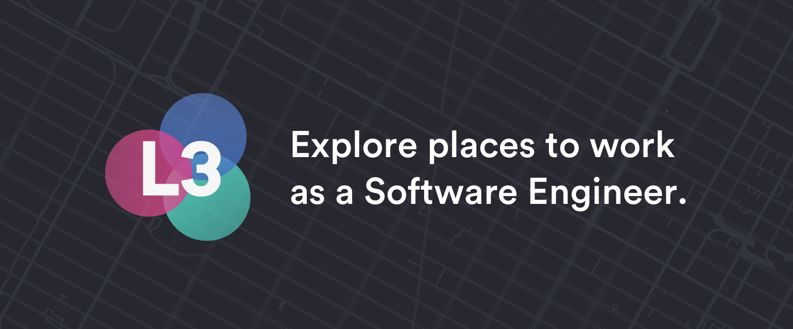

[](https://github.com/miltonleung/L3)

[](https://itunes.apple.com/us/app/l3-visualize-the-job-market/id1455751013?ls=1&mt=8)

[Read the Medium article here](https://www.medium.com)

## Mission
Home is where your job is. When coming up with this app idea, we had a lot of questions about what it was like to be a software engineer in any given city.

Sure, everyone knows San Francisco, Silicon Valley and New York City has the biggest tech scenes. But by how much? And how much bigger is it actually than booming places like Seattle, Austin, and Salt Lake City?

We think L3 helps us visualize this and compare cities in a beautiful and interactive way. For example, San Francisco has the highest salary but also the highest cost of living, hmmm.

Use the map to find your next home or use it as a night lamp.

## Features
* Search restaurants based on location
* Select a preferred time to dine
* View restaurant photos and reviews
* Vote for the restaurant you want to eat

## Getting Started
1. [Download](https://developer.apple.com/xcode/download/) the latest Xcode release.
2. Clone this repository.
3. Add the mapbox access token in the following format:
```
<key>MGLMapboxAccessToken</key>
<string>PUT TOKEN HERE</string>
```
4. Build!

## Contributing
Whether you're suggesting new features or filing bug reports, we think the best way to do so is through a Github issue. We can't wait to see what we'll make together!
